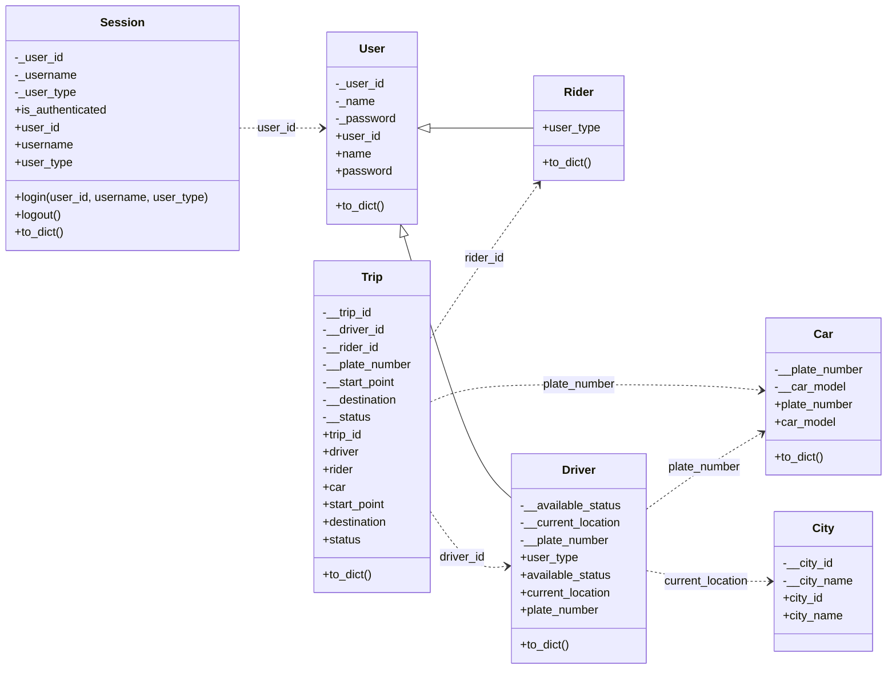

# Ride Booking System

Dockerized full-stack ride booking application:
- `backend`: FastAPI service on container port `8000`
- `frontend`: React/Vite app served by Nginx on container port `80`
- `nginx` reverse proxy routes `/api/*` from frontend to backend

## Docker Architecture

- Multi-stage build in [Dockerfile](/home/zeno/Ride-Booking-System/Dockerfile)
- Service orchestration in [docker-compose.yml](/home/zeno/Ride-Booking-System/docker-compose.yml)
- Frontend routing/proxy config in [docker/nginx.conf](/home/zeno/Ride-Booking-System/docker/nginx.conf)
- Persistent backend file storage via named volume `app-data` mounted at `/app/persistence/data`

## UML Class Diagram



## Prerequisites

- Docker Engine
- Docker Compose (`docker compose`)

## Build and Run

Build and start services:

```bash
docker compose up -d --build
```

Check status:

```bash
docker compose ps
```

Stop services:

```bash
docker compose down
```

Stop and remove volume data:

```bash
docker compose down -v
```

## Access URLs

- Frontend: `http://localhost:${FRONTEND_PORT}` (default `http://localhost:3000`)
- Backend API docs: `http://localhost:${BACKEND_PORT}/docs` (default `http://localhost:8000/docs`)

## Verify Environment Variables in Containers

Backend:

```bash
docker compose exec -T backend env
```

Frontend:

```bash
docker compose exec -T frontend env
```

## Data Persistence

Backend creates and uses these files inside `/app/persistence/data`:
- `rider.txt`
- `driver.txt`
- `car.txt`
- `trip.txt`
- `temp_trip.txt`

These files are persisted in Docker volume `app-data`.

## Common Operations

Rebuild after changing frontend `VITE_*` values:

```bash
docker compose up -d --build frontend
```

View logs:

```bash
docker compose logs -f backend
docker compose logs -f frontend
```

Restart one service:

```bash
docker compose restart backend
docker compose restart frontend
```

## Troubleshooting

- Port already in use:
  - Change `BACKEND_PORT` or `FRONTEND_PORT`, then run `docker compose up -d`.
- Frontend cannot reach API:
  - Ensure `VITE_API_BASE_URL=/api` and rebuild frontend image.
  - Confirm backend health: `docker compose ps` and `docker compose logs backend`.
- Changed code not reflected:
  - Rebuild images: `docker compose up -d --build`.
